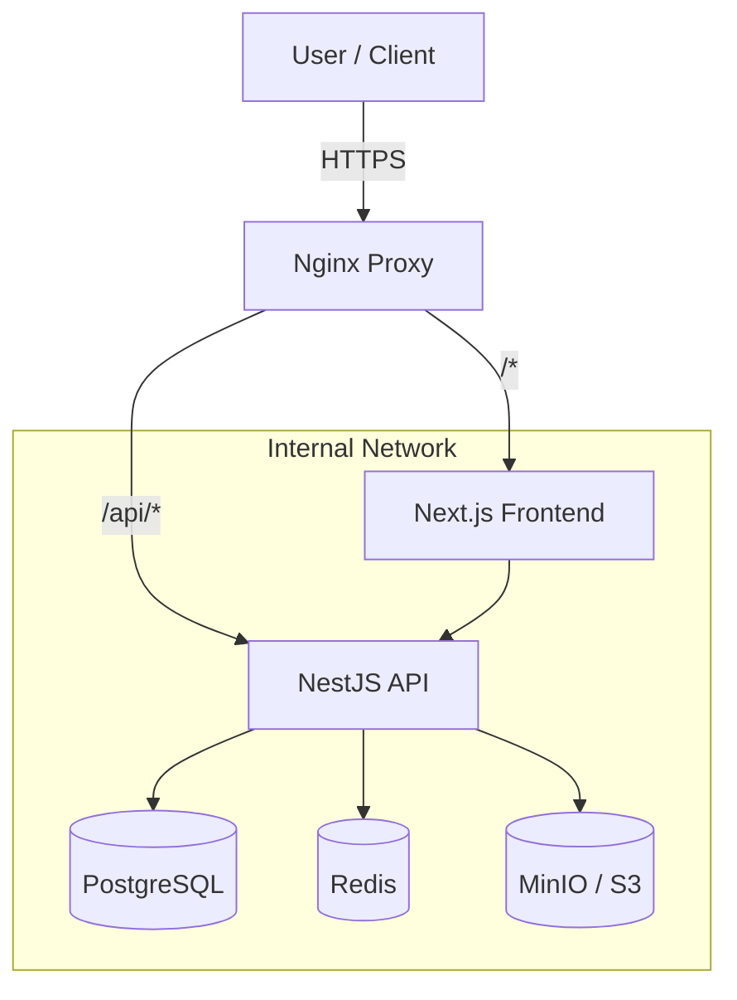

# Project Overview

The Math&Maroc Event Platform is a scalable, monorepo-based application designed to manage the entire lifecycle of educational events, from application submission to attendance tracking.

## Architecture

The platform follows a **Modern Monorepo Architecture** using Turborepo. It separates concerns between the specific applications (API, Web) and shared packages (DB, Utils, Schemas).



## Technology Stack

### Backend
- **Framework**: NestJS (Node.js)
- **Language**: TypeScript
- **Database**: PostgreSQL 15
- **ORM**: Prisma
- **Caching/Queues**: Redis 7
- **Storage**: AWS S3 / MinIO
- **Email**: Nodemailer (SMTP)

### Frontend
- **Framework**: Next.js 14 (App Router)
- **Language**: TypeScript
- **Styling**: Tailwind CSS v4 + shadcn/ui
- **State**: TanStack React Query + React Context
- **Forms**: React Hook Form + Zod
- **Icons**: Lucide React

### Infrastructure
- **Containerization**: Docker & Docker Compose
- **Orchestration**: Docker Compose (Single Host)
- **Proxy**: Nginx

## Repository Structure

```
├── apps/
│   ├── api/          # NestJS Backend Application
│   │   ├── src/
│   │   └── Dockerfile
│   └── web/          # Next.js Frontend Application
│       ├── app/      # App Router Pages
│       └── components/
├── packages/
│   ├── db/           # Prisma Client & Schema
│   ├── shared/       # Shared Types, DTOs, Utilities
│   ├── schemas/      # Shared Zod Schemas (Frontend <-> Backend)
│   └── config/       # Shared ESLint/TSConfig
├── infra/
│   ├── docker/       # Infrastructure config
│   └── nginx/        # Nginx config
└── docs/             # Documentation (You are here)
```

## Key Concepts

### 1. Event-Centric Design
Everything in the system revolves around **Events**. Users apply to events, staff manage events, and microsites belong to events. The `slug` is the primary identifier for events in public URLs.

### 2. Microsite Builder
Each event has a customizable **Microsite**. Staff can build pages using a drag-and-drop block system (Hero, Text, FAQ, Schedule, etc.). The frontend renders these blocks dynamically.

### 3. Application Workflow
Applications are not static. They go through a **Workflow**:
- **Steps**: An application consists of multiple steps (Forms, File Uploads).
- **Review**: Reviewers score or approve steps.
- **Decision**: Admins make final decisions (Accept, Reject, Waitlist).
- **Confirmation**: Accepted applicants must confirm attendance.

### 4. Role-Based Access Control (RBAC)
The system has a robust permission system:
- **Global Roles**: `Global Admin` (God mode).
- **Event Roles**: `Organizer`, `Reviewer`, `Check-in Staff`, `Content Editor`.
- **User Roles**: `Applicant` (Default).
Permissions are checked at the Guard level in the API.
